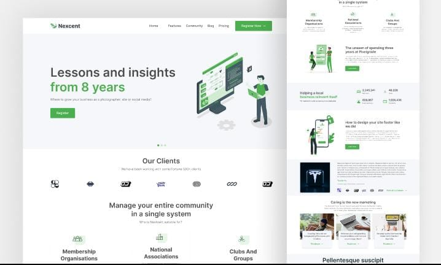

# Nexcent Landing Page

A clean, responsive landing page built with **HTML**, **CSS**, **JavaScript**, and **Tailwind CSS**, based on a modern design I recreated from a Figma prototype.

---

## 🔍 Overview

This project is a pixel-perfect recreation of a Figma design for a fictional brand called **Nexcent**. It was built to sharpen my frontend skills and demonstrate how to bring design concepts to life using modern web technologies.

---

## 🎨 Figma Design

Here’s the original design used as reference for this project:

👉 [View Figma Design](https://www.figma.com/community/file/1222060007934600841/responsive-landing-page-design-website-home-page-design-agency-website-ui-design)

---

## 🚀 Features

- Fully responsive layout for desktop, tablet, and mobile  
- Utility-first styling with Tailwind CSS  
- Smooth animations and transitions  
- Semantic and well-structured HTML  
- Functional navigation and dynamic behavior with JavaScript

---

## 🛠 Tech Stack

- **HTML5**  
- **CSS3**  
- **Tailwind CSS**  
- **JavaScript (ES6)**

---

## 📸 Preview



🌐 [Live Demo](https://nexcent-landing-ebon.vercel.app/)

---

## 📌 How to Use

1. Clone the repository:
   ```bash
   git clone https://github.com/numcodes/nexcent-landing.git```
   
2. Open *index.html* in your browser or use a live server.

> Tailwind is included via CDN. You can optionally configure Tailwind CLI or PostCSS for production optimization.

---

## 🧠 What I Learned
* Converting Figma designs into functional code

* Responsive layout building with Tailwind utility classes

* Structuring clean and maintainable HTML/CSS/JS code

* Creating engaging and user-friendly UI/UX

---

## 🤝 Acknowledgments
* Figma design inspiration

* Tailwind CSS for the styling framework

* Free illustrations and icons used (if applicable)

---

## 📬 Feedback
Got suggestions, ideas, or feedback? Feel free to reach out or open an issue on the repository. I’m always open to improving and collaborating.